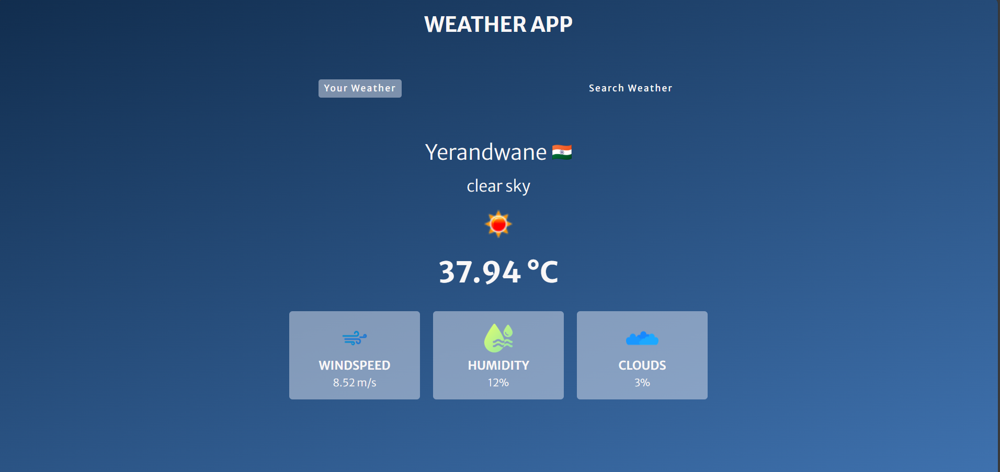

# 🌦️ Weather App

A simple and clean **Weather App** built using **HTML**, **CSS**, and **JavaScript**. This project fetches real-time weather data from the **OpenWeatherMap API** and displays weather information based on the user's input city.

## 🔍 Features

- 🔎 Search weather by city name
- 🌡️ Displays temperature, humidity, wind speed, and conditions
- 🖼️ Dynamic weather icons
- 🎨 Simple and responsive UI

## 🌐 Tech Stack

- HTML
- CSS
- JavaScript
- OpenWeatherMap API

## 📸 Screenshots


## 🚀 Getting Started

### 1. Clone the repository

```bash
git clone https://github.com/adityajagtap2704/Weather_App.git
cd Weather_App
